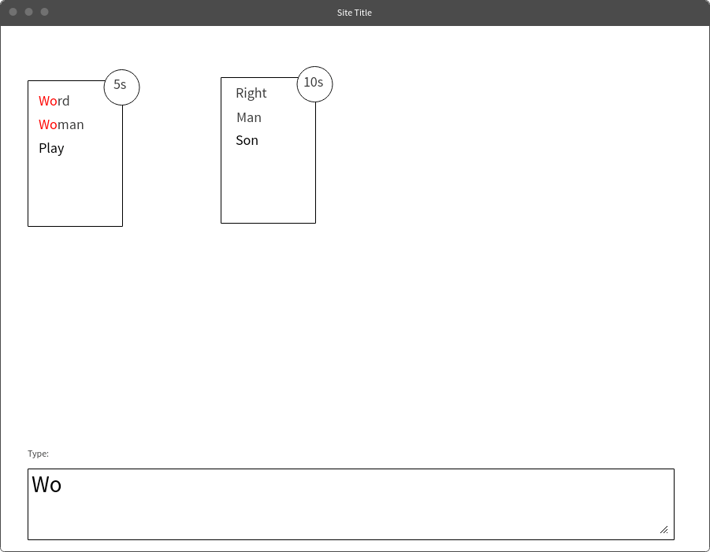

In this series, I am creating a typing game with React and Redux. Including setting up a backlog, CI, and Testing.
You can find the project [here](https://github.com/nadeemkhedr/typemania)

This post is part of the ***"Making a game with React and Redux"*** series
1. [Getting Started](/making-a-game-with-react-and-redux-getting-started/)
2. **Plan, Define, Build Process** <-
3. [Core Mechanics](/making-a-game-with-react-and-redux-03-core-mechanics/)

---

I am treating this project as a real world project, I will talk about the right way of starting a project from planning, setting releases, and using merge strategies to defining stories, setting boundaries, and finally automating the build process to work in our favor as much as possible.
In this post, I will cover these points and, at the same time in the repo I will use best practices so it is easy to compare.

## Plan

I want to create a typing game with space invaders flavor

The game will consist of blocks, each block containing multiple words, and a counter, if the counter reaches zero then the player loses.

Screenshot:


Our plan is simple; we will create two releases, the first release being the core game features and the second will be enhancements

#### First Release:
- Dynamically adding blocks with random words
- While typing, if the word sub matches, it should highlight that on all the words
- Timer functionality on blocks
- UI design

#### Second Release:
- Health system (you shouldn't die after health reaches zero)
- Increased difficulty with time
- powerups
    - Freeze (pause the timer), Fire (destroy a block)
- Statistics
    -  how many words you wrote
    -  random word definition after the game finishes
    -  wpm speed
- multiplayer (maybe ?)

### Strategies

A different type of planning is choosing a merge strategy, and how to manage the git repo. I will go with git flow. To read more about the topic of merge strategies check this [guide](http://www.creativebloq.com/web-design/choose-right-git-branching-strategy-121518344).

Another great topic that is not often looked into is commit message format; we will be using the [angular guideline](https://github.com/angular/angular.js/blob/master/CONTRIBUTING.md#commit), which I highly recommend.

A great github tool that helps us to standardize PRs & Issues format is to use templates. Creating `ISSUE_TEMPLATE.md` and `PULL_REQUEST_TEMPLATE.md` will pre-fill the text when creating an issue or a PR.
It is useful to put guidelines on steps/sections when creating issues/PRs so that every user will respect them.

I think, when starting a project, these are some of the most important things to prepare at first to ensure the consistency of the project.


## Define

The biggest issue when working on a new project is not setting up the definition of done.
Setting a release plan and also boundaries for each task instead of just working on the game is important for many reasons.
**Just** working on a game will drag on forever, because whenever you should be working on one feature, you will find yourself constantly creating/working on new, unrelated features

To avoid this, I am going to use [zenhub](https://www.zenhub.com/) for creating and managing stories. ZenHub extends GitHub, and all stories you create are GitHub issues with the added bonus of having another tab in GitHub (Board) from it, so you can easily manage sprints.

The benefit of using all these tools is that, now, everything is on Github, it is the single source of truth.

The other part of defining is trying to be as detailed as possible. One thing I see a lot is vague stories. Let me tell you an example:

#### Vague Story Example

> As an admin I want to be able to delete other users

 You might find this definition is okay, but If I got assigned to this story, I would have the following questions:

 - Can an admin delete other admins?
 - When deleting, should I show a confirmation dialog, undo button, or some other verification method?
 - When deleting a user, should I remove the record from the DB, or should I add an `inactive` field?

## Build Process

There are two things I want to do here

- add precommit to run linting & testing
- add Travis for running the tests before accepting the


we can use [husky](https://github.com/typicode/husky) for preventing bad commits; it adds hooks to run `precommit` & `prepush` scripts, so what we could do is, in `package.json`
```
scripts: {
    "precommit": "npm run lint && npm test"
    ...
}
```

Adding Travis is simple, we will create `.travis.yml` with the following

```
language: node_js
node_js:
  - 6
cache:
  directories:
  - node_modules
script:
  - npm test
```
After that, going to [travis](https://travis-ci.org) and adding the github project will do the trick.
Now Travis will run `npm test` after pushing code while working on a feature
