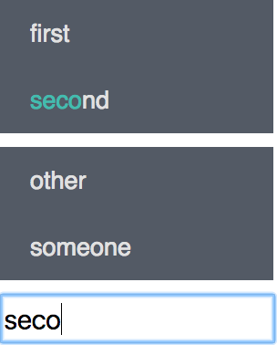

In this series, I am creating a typing game with React and Redux. Including setting up a backlog, CI, and Testing.
You can find the project [here](https://github.com/nadeemkhedr/typemania)

This post is part of the ***"Making a game with React and Redux"*** series
1. [Getting Started](http://nadeemkhedr.com/making-a-game-with-react-and-redux-getting-started/)
2. [Plan, Define, Build Process](http://nadeemkhedr.com/making-a-game-with-react-and-redux-02-plan-define-build-process/)
3. **Core Mechanics** <-

---

### Agenda
- Create core reducers
    - Words ([Issue](https://github.com/nadeemkhedr/typemania/issues/1)/[Pull Request](https://github.com/nadeemkhedr/typemania/pull/5))
    - Blocks ([Issue](https://github.com/nadeemkhedr/typemania/issues/2)/[Pull Request](https://github.com/nadeemkhedr/typemania/pull/6))
    - Input ([Issue](https://github.com/nadeemkhedr/typemania/issues/3)/[Pull Request](https://github.com/nadeemkhedr/typemania/pull/9))
- Create Basic UI Components ([Issue](https://github.com/nadeemkhedr/typemania/issues/4)/[Pull Request](https://github.com/nadeemkhedr/typemania/pull/10))

###Plan
My plan of attack is to create a basic version of the game without any words/blocks generation. To achieve that, first I will create detailed issues (stated above) for what exactly I want to get done

There will be three elements in the game at this point

- Blocks (a block contains multiple words)
- Words (can only be found inside a block)
- Input (the input where the player enters text)

I will implement the following

- When the user enters text, and it matches any word, that word should be removed. If a block is empty it is also removed
- When the user enters text, the sub-matching words should be highlighted

### Getting to work
Equipped with a cup of coffee and with having some free time, I started to work on the first two reducers (words, blocks) it was straight forward.

> When creating reducers, one of my goals was to keep the data normalized (read [this article](http://redux.js.org/docs/recipes/reducers/NormalizingStateShape.html) from the redux guide for more about the topic) and to capture as many details in the task itself as possible.

Next task is to implement the inputs reducer. This reducer is a little different, a couple of new concepts are introduced here

- thunks (added via [redux-thunk](https://github.com/gaearon/redux-thunk) package
- Selectors (check this [video](https://egghead.io/lessons/javascript-redux-colocating-selectors-with-reducers) for why we need selectors by Dan Abramov - *Dan is the creator of redux*)

> A thunk allows actions creators to return a function instead of an object, which enables performing logic that determines what actions to dispatch.

We need this ability, because when the user enters some text, we need to not only update the input in the store but also check if the word matches any other to remove them and the empty blocks, if there are any.
We also have to reset the input, if any word is matched. We use selectors in this process to get all the matching words and empty blocks.

After working on the reducers, I realized that I needed to add templates for PR and Issues, for the sake of keeping everything consistent and not repetitive (you can find the templates in this [PR](https://github.com/nadeemkhedr/typemania/pull/8))

Finally, to wire everything together, I need to build the actual UI components ([Issue here](https://github.com/nadeemkhedr/typemania/issues/4)).

The first step is adding [react-router](https://github.com/ReactTraining/react-router), We will not use routing yet, we will only setup a default route to our game (this will change in the future)

In this task, we are creating all the components/containers used for the core game.

Summary about what is happening in the [PR](https://github.com/nadeemkhedr/typemania/pull/10)

- Selectors are used all over the place here for fetching the data
- The `Word` component has logic to highlight the part of a word that matches what is typed
- Add [enzyme](https://github.com/airbnb/enzyme) and [react-addons-test-utils](https://facebook.github.io/react/docs/test-utils.html) for testing
- Keeping components testing to a minimum, instead testing reducers, selectors, action creators
- pretty bad CSS (will tackle that topic in the next article)

Now our game looks like this

